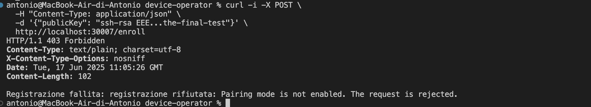
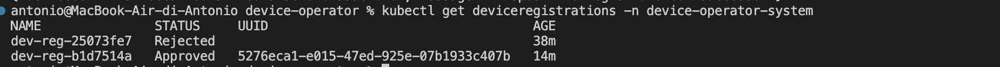

# Progetto: Device Enrollment Operator per Kubernetes

Questo progetto implementa un sistema robusto e sicuro per la registrazione e la gestione del ciclo di vita di dispositivi esterni (come sensori IoT o dispositivi edge) in un cluster Kubernetes. L'architettura simula un ambiente di produzione, utilizzando un **Operator** per la logica di business e un **Gateway** come punto di ingresso sicuro.

## Architettura e Workflow

Il sistema si basa su un'interazione orchestrata tra diversi componenti per garantire che solo i dispositivi autorizzati possano essere registrati, e solo quando un amministratore lo consente esplicitamente.


*(Diagramma del workflow di registrazione del dispositivo)*

#### Componenti Principali:

1.  **Gateway (`device-gateway`)**:
    -   È un servizio web Go che espone un singolo endpoint HTTP (`POST /enroll`).
    -   Agisce come unico punto di contatto per i dispositivi che desiderano registrarsi.
    -   Non contiene logica di business; il suo unico compito è ricevere una richiesta, tradurla in una risorsa Kubernetes (`DeviceRegistration`), e attendere l'esito.

2.  **Operator (`device-operator`)**:
    -   È il cuore del sistema, scritto in Go utilizzando il framework Kubebuilder.
    -   Monitora costantemente le risorse `DeviceRegistration` nel cluster.
    -   Quando ne rileva una nuova, implementa la logica di approvazione: controlla se la "Modalità di Pairing" è attiva.
    -   Se attiva, approva la richiesta, genera un UUID univoco e aggiorna lo stato della risorsa.
    -   Se disattiva, rifiuta la richiesta.
    -   Gestisce anche altre operazioni del ciclo di vita, come la deattivazione.

3.  **Custom Resource Definition (`DeviceRegistration`)**:
    -   Estende l'API di Kubernetes, definendo un nuovo tipo di risorsa.
    -   La `spec` della risorsa contiene i dati inviati dal dispositivo (es. la sua chiave pubblica).
    -   Lo `status` viene popolato dall'Operator e contiene l'esito della registrazione (fase, UUID, timestamp).

4.  **ConfigMap (`device-pairing-config`)**:
    -   Funziona come un interruttore globale.
    -   Un amministratore può modificare questo `ConfigMap` per abilitare (`enabled: "true"`) o disabilitare (`enabled: "false"`) la registrazione di nuovi dispositivi a livello di cluster, senza dover modificare o riavviare l'Operator.

---

## Prerequisiti

Per eseguire questo progetto, avrai bisogno dei seguenti strumenti:

-   **Docker Desktop**: Per eseguire i container.
-   **Go**: Versione 1.22 o successiva, per costruire le applicazioni.
-   **k3d**: Per creare un cluster Kubernetes locale leggero basato su Docker.
-   **kubectl**: L'interfaccia a riga di comando per interagire con Kubernetes.
-   **make**: Per eseguire facilmente i comandi di build e deploy definiti nel `Makefile`.

---

## Guida all'Installazione e al Deploy

Segui questi passaggi per avviare l'intero sistema sul tuo computer.

### 1. Clona il Repository

Ottieni il codice sorgente del progetto.
```sh
git clone https://github.com/antonio/device-operator.git
cd device-operator
```

### 2. Crea un Cluster Kubernetes con k3d

È fondamentale creare il cluster con una mappatura delle porte. Questo ci permetterà di inviare richieste di test dal nostro computer (host) al Gateway in esecuzione all'interno del cluster.

```sh
# Il flag -p "30007:30007@loadbalancer" mappa la porta 30007 del tuo
# computer alla porta NodePort del nostro servizio Gateway.
k3d cluster create dev --agents 1 -p "30007:30007@loadbalancer"
```

### 3. Costruisci e Importa le Immagini Docker

Ogni componente (Operator e Gateway) viene pacchettizzato in un'immagine Docker.

```sh
# 1. Costruisci l'immagine dell'Operator (usa un tag di versione, es. v1.0)
make docker-build IMG=antonio/device-operator:v1.0

# 2. Costruisci l'immagine del Gateway
docker build -t antonio/device-gateway:v1.0 -f gateway/Dockerfile .

# 3. Importa entrambe le immagini nel registro interno del cluster k3d
#    Questo passaggio è necessario affinché Kubernetes possa trovarle.
k3d image import antonio/device-operator:v1.0 -c dev
k3d image import antonio/device-gateway:v1.0 -c dev
```

### 4. Deploya l'Operator e il Gateway

Con le immagini pronte, possiamo distribuire le applicazioni nel cluster.

```sh
# 1. Deploya l'Operator
#    Questo comando installa la CRD, i ruoli RBAC e il Deployment dell'Operator.
make deploy IMG=antonio/device-operator:v1.0

# 2. Deploya il Gateway
#    Questo comando installa il ServiceAccount, i ruoli e il Deployment del Gateway.
kubectl apply -f config/gateway/
```

### 5. Verifica che Tutto sia in Esecuzione

Controlla lo stato dei Pod nel namespace `device-operator-system`.

```sh
kubectl get pods -n device-operator-system
```

Attendi finché entrambi i Pod non raggiungono lo stato `Running` (`READY 1/1`).

```
NAME                                                  READY   STATUS    RESTARTS   AGE
device-gateway-xxxxxxxxxx-xxxxx                       1/1     Running   0          ...
device-operator-controller-manager-yyyyyyyyyy-yyyyy   1/1     Running   0          ...
```

---

## Come Testare il Sistema

Ora che tutto è in esecuzione, simuliamo le interazioni di un dispositivo usando `curl`.

### Scenario 1: Registrazione Rifiutata (Pairing Disabilitato)

Per impostazione predefinita, il `ConfigMap` di pairing non esiste, quindi la registrazione è disabilitata. Questo è il test perfetto per verificare la sicurezza del sistema.

**Comando:** Invia una richiesta di registrazione.
```sh
curl -i -X POST \
  -H "Content-Type: application/json" \
  -d '{"publicKey": "ssh-rsa AAA...test-denied"}' \
  http://localhost:30007/enroll
```

**Risultato Atteso:** Dovresti ricevere un errore `HTTP/1.1 403 Forbidden`. Questo è un successo, perché dimostra che il sistema blocca correttamente le registrazioni non autorizzate.
```
HTTP/1.1 403 Forbidden
...
Registrazione fallita: registrazione rifiutata: Pairing mode is not enabled. The request is rejected.
```

### Scenario 2: Registrazione Approvata (Pairing Abilitato)

Ora testiamo il "percorso felice".

**1. Abilita la Modalità di Pairing**
Crea e applica un `ConfigMap` per abilitare la registrazione.
```sh
# Applica il file di configurazione per il pairing
kubectl apply -f config/samples/pairing-config.yaml
```
*(Assicurati che il file `config/samples/pairing-config.yaml` esista e contenga `enabled: "true"`)*

**2. Invia una nuova richiesta di registrazione**
```sh
curl -i -X POST \
  -H "Content-Type: application/json" \
  -d '{"publicKey": "ssh-rsa BBB...test-approved"}' \
  http://localhost:30007/enroll
```

**Risultato Atteso:** Questa volta, la richiesta dovrebbe avere successo, restituendo `HTTP/1.1 200 OK` e un JSON contenente l'UUID univoco assegnato al dispositivo.
```
HTTP/1.1 200 OK
...
{"deviceUUID":"<uuid-generato-casualmente>","message":"Dispositivo registrato con successo."}
```
**Congratulazioni, l'intero workflow funziona!**

### Gestione del Ciclo di Vita di un Dispositivo

Una volta che un dispositivo è registrato, la sua esistenza è rappresentata da una risorsa `DeviceRegistration`. Puoi trovarla e gestirla.

**1. Lista tutti i dispositivi registrati:**
```sh
kubectl get deviceregistrations -n device-operator-system
```
L'output mostrerà le risorse create (con nomi casuali come `dev-reg-xxxxxx`).

**2. Deattiva un dispositivo:**
Per deattivare un dispositivo approvato, usa `kubectl patch`.
```sh
# Sostituisci <nome-della-risorsa> con un nome dall'elenco precedente
kubectl patch deviceregistration <nome-della-risorsa> -n device-operator-system --type=merge -p '{"spec":{"deactivate":true}}'
```
L'Operator rileverà questa modifica e aggiornerà lo stato del dispositivo a `Deactivated`.

---

## Pulizia

Per rimuovere tutte le risorse create e cancellare il cluster `k3d`, esegui questo comando:
```sh
k3d cluster delete dev
```
Per rimuovere un device, esegui questo comando:
```sh
kubectl get deviceregistrations -n device-operator-system
```
Seccusseivamente:
```sh
# Sostituisci <nome-della-risorsa> con il nome del dispositivo da rimuovere
kubectl delete deviceregistration <nome-della-risorsa> -n device-operator-system
```
Risultato atteso: deviceregistration.devices.example.com "nome-della-risorsa" deleted

## Immagini del test



## Eseguire il Client di Test (Simulatore MCU)

Per completare il ciclo e simulare un dispositivo reale che si registra, è stato creato un client di test in **Rust**. Questo script si comporterà come un'Unità a Microcontrollore (MCU) che avvia il processo di enrollment.

Per runnare l'MCU basta entrare all'interno della cartella "mcu_client" e lanciare da terminale "cargo run". Da lì partirà la generazione delle chiavi e l'enrollment.